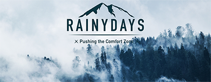

# RainyDays



This project was the accumulation of all course work during the first year at Noroff. It is a webstore to buy jackets.

## Description

This goal of this project is to experiment with different technologies and techniques to grow my skills. Both the design phase, and development phase reflect skills I have learned. These skills are:

- Creating prototypes with Figma
- API-calls
- API management
- Wordpress
- WooCommerce
- URL management
- javascript
- HTML and CSS
- User experience (UX) through [Hotjar](https://hotjar.com/)

[The hosted site can be seen here](https://sparkling-sunflower-134017.netlify.app/)

### Design Phase

The design phase was to have a site which showed the products and filtering featured products. I wanted to have a scrolling option to display jackets on the front page. The design was done through [Figma](https://figma.com/) and the [prototype can be seen here.](https://www.figma.com/file/2xl3QwUXP716McQIiRpXtm/Rainydays-CA-Design?type=design)

### Development Phase

The development of this webpage has been from a basic HTML/CSS website, to a website using javascript as well. Later on, the use of an API created through [Wordpress](https://wordpress.com/) and [WooCommerce](https://woocommerce.com/) was used to display current prices as well as removing hardcoded values.

The website was also hosted by using [Netlify](https://netlify.com/), and the API was hosted using [Wordpress](https://wordpress.com/) and [WooCommerce](https://woocommerce.com/).

## Built With

The technologies used to create this project from the design, creating the API, and development were:

- [Figma](https://figma.com/)
- [HTML5](https://www.w3.org/TR/2011/WD-html5-20110405/)
- [CSS3](https://www.tutorialspoint.com/css/css3_tutorial.htm)
- [JavaScript](https://devdocs.io/javascript/)
- [Hotjar](https://hotjar.com/)
- [Wordpress](https://wordpress.com/)
- [Netlify](https://netlify.com/)
- [WooCommerce](https://woocommerce.com/)

## Getting Started

### Installing

1. Clone the repo:

```bash
git clone git@github.com:Noroff-FEU-Assignments/cross-course-project-idanguyen.git
```

### Running

There are no dependencies, use your preffered browser and run index.html. You also have the option to deploy the website by using e.g. [Netlify](https://netlify.com/).

## Contributing

If you want to contribute to this project open a pull request.

## Contact

[Email](ida_nguyen@outlook.com)

[My LinkedIn page](https://www.linkedin.com/in/ida-nguyen-441709187)
